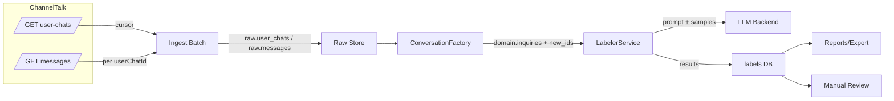
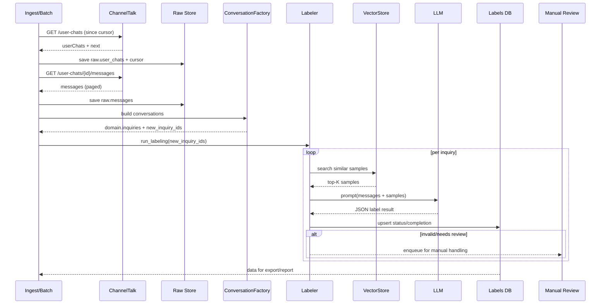

# ChannelTalk 자동 라벨러 – 아키텍처 리뷰 자료

팀장/동료들을 대상으로 현재 설계와 구현 진행 상황을 빠르게 공유하기 위한 브리핑 노트다. 상세 근거는 `docs/channel-open-api/README.md`와 `docs/dev-workflow.md`를 참고한다.

## 1. 미팅 목적 & 범위
- ChannelTalk Open API 기반 문의 라벨링/리포트 파이프라인의 **엔드-투-엔드 구조**를 명확히 보여준다.
- **주요 결정 사항**(데이터 계층화, 라벨링 흐름, 배치 트리거, 확장 전략)을 정리해 팀장 피드백을 받는다.
- 현 단계에서 **구현이 끝난 데모 흐름**과 **남은 리스크/우선 과제**를 공유한다.

## 2. 시스템 컨텍스트

### 2.1 시퀀스 다이어그램

## 3. 파이프라인 개요
| 단계 | 입력 | 출력 | 핵심 포인트 |
| --- | --- | --- | --- |
| Ingest | ChannelTalk API (`user-chats`, `messages`) | `raw.user_chats`, `raw.messages`, `cursor state` | Cursor 기반 pagination, Raw JSON 보존 |
| Normalize | Raw 레이어 | `domain.inquiries`, `inquiry_messages`, `new_inquiry_ids` | Conversation 단위 정규화, meta 보존 |
| Label | `new_inquiry_ids`, 샘플 라이브러리 | `labels` (status/summary/reasoning) | 샘플 벡터 검색 + 프롬프트 + LLM + 검증 |
| Export/Insight | `inquiries + labels` | CSV/리포트/UI 탭 | 주간 라벨 비중, 상위 문의 요약, 다운로드 |

## 4. 주요 컴포넌트 책임
- **ChannelTalkClient / Fetcher**: API 호출, retry, cursor 저장.
- **RawStore**: 응답 JSON & 커서를 그대로 적재해 재처리 대비.
- **ConversationFactory**: 메시지 정렬/병합, Participants·Meta 구성, `new_inquiry_ids` 산출.
- **SampleLibrary + VectorStore**: 샘플 CSV 업로드 → 임베딩 → similarity 검색.
- **PromptBuilder + LLMService**: context/task/instruction 조합, OpenAI 기본·다른 백엔드 교체 가능하도록 추상화.
- **LabelRunManager**: run 추적, 실패/재시도/수동 검토 상태 로깅.
- **Streamlit UI (Mock Batch/Insight)**: 샘플 업로드 → Mock ChannelTalk 배치 → 라벨링 → Export → 인사이트 확인까지 시연.

## 5. 데이터 계층 전략
1. **Raw Layer** (`raw_user_chats`, `raw_messages`): API 응답 원본 + cursor + fetched_at을 JSONB/Parquet로 보존.
2. **Domain Layer** (`inquiries`, `inquiry_messages`): `conversation_id` 기준 canonical 스키마, meta JSON으로 확장성 유지.
3. **Label Layer** (`labels`, `label_audit`): 라벨 결과/버전/출처/상태(complete, needs_review, failed) 추적.
4. **Results/Exports**: `inquiries + labels` 조인 → CSV, Insight UI, 추후 BI/SQL 연계.

## 6. 라벨링 세부 흐름
1. **샘플 관리**: 사람이 입력한 JSON/CSV → 검증 → 임베딩 → VectorStore 저장. 샘플 스키마가 곧 라벨 스키마.
2. **유사도 검색**: `SimilarityRetriever`가 문의 임베딩과 top-K 샘플을 반환.
3. **프롬프트 구조**:  
   - *System*: 역할/출력 형식 제약  
   - *Context*: 문의 meta(태그, 매니저, 요약) + 샘플 목록  
   - *Messages*: 시간순 transcript (민감정보 마스킹)  
   - *Task*: 허용 라벨, JSON 필드(`label_primary`, `label_secondary`, `confidence`, `reasoning`, `summary`) 지시
4. **검증/재시도**: JSON 파싱 실패, 라벨 스키마 불일치, confidence threshold 미달 시 자동 재시도 → 실패 시 `status=failed`로 기록 및 Manual Review 큐.
5. **Manual Review / Retry**: 실패/미확신 목록을 UI/CSV로 노출, 사람이 수정하면 `label_audit`에 소스로 기록.

## 7. 배치 & 트리거
- **Push 방식**: `ConversationFactory`가 `new_inquiry_ids` 리스트 반환 → 같은 배치 내에서 `LabelerService` 호출. 라벨러는 ID로 도메인 데이터를 다시 조회하므로 결합도 최소화.
- **커서 관리**: `/user-chats` 응답의 `next`를 `since`로 재사용, 메시지 API도 ID별 `since` 옵션으로 이어받기.
- **Mock 데모**: `make demo-batch` 또는 Streamlit Mock Batch 탭 → Raw 생성, Domain 변환, 자동 라벨링, 실패 ID 로그, Export 파일 생성.

## 8. UI/리포트 현황
- **Mock Batch 탭**: 샘플 업로드, Mock API 호출, 자동 라벨링 버튼, 최근 실행 상태·실패 ID·원본/라벨 CSV 다운로드.
- **라벨링 데이터 뷰**: 문의별 대화/라벨/요약을 테이블로 열람, 검색/필터.
- **Insight 탭**: 라벨별 주간 비중, 가장 많이 발생한 라벨 샘플 텍스트, 추이 코멘트.
- **향후**: 엑셀 Export 구조를 channelId 단위 transcript + 라벨 메타 조합으로 유지해 외부 분석/조인 가능.

## 9. 확장 고려 사항
- **다중 소스**: Adapter 패턴을 유지하면 ChannelTalk 외 CSV/다른 API도 동일 파이프라인으로 라벨링 가능.
- **LLM 백엔드 교체**: `LLMBackend` 프로토콜로 OpenAI/HuggingFace/사내용 모델을 손쉽게 교체.
- **대규모 데이터**: Raw/Domain을 Parquet/S3, Label/Report를 DuckDB/warehouse로 전환 가능.
- **Analytics**: Insight 탭 → 주간 리포트 → BI/SQL 서비스 확장. `domain + labels` 스키마가 핵심.
- **모니터링/알림**: 라벨 실패율, 커서 정지, API 에러를 metrics/logging으로 기록해 Slack/Email 알림 연결 계획.

## 10. 리스크 & 다음 액션
| 구분 | 내용 | 대응 계획 |
| --- | --- | --- |
| 라벨 스키마 동기화 | 샘플 CSV/Mock 데이터/라벨러가 사용하는 스키마가 아직 완전히 일치하지 않음 | `channel_agent` 데이터 참고해 스키마 통일, 샘플 ingestion → UI/CLI 공유 |
| LLM 호출 실패/비용 | Demo 환경에서 OpenAI 호출 실패 경험 → 재시도/로깅 강화 필요 | `LLMService`에 retry/backoff + fallbacks 추가, Mock 모드와 실모드 구분 |
| Insight 정확도 | 주간 통계 계산 시 데이터 적재량 한정 | Mock 데이터 다양화, 실제 API 연동 전 CSV dump 기반 통계 검증 |
| 운영 자동화 | 현재는 수동 버튼/CLI | Prefect/Airflow 도입 전까지 Make/CLI 체인 정리, cron 스크립트 후보 작성 |

## 11. 리뷰 시 강조 포인트
1. **Conversation 단위 계층화**로 향후 다중 소스/리포트 요구에도 재사용 가능.
2. **Push 기반 라벨 트리거**로 배치→라벨러 결합도를 낮추고 재시도/수동 검토를 단순화.
3. **샘플 기반 라벨 스키마** + **VectorStore**로 LLM 품질/일관성을 확보.
4. **UI 데모**로 설계 내용을 즉시 확인할 수 있어 이해관계자 설득 용이.
5. **장기 확장 계획**(다른 데이터 소스, BI, 모니터링)을 이미 문서화해 요구 변경에 대비.

이 문서를 기반으로 리뷰 미팅을 진행하면, 설계 근거와 구현 진행 상황을 한 장에서 설명할 수 있다.

## 12. 플로우 세부 설명 & 고려 사항

### 12.1 Ingest → Raw
- **단계**
  1. 배치 러너가 `cursor_state.json`을 읽어 `/user-chats` 호출.
  2. 응답 `next`를 즉시 저장하고, payload 전체를 `raw_user_chats`에 append.
  3. 새 `userChatId`마다 `/messages`를 호출해 `raw_messages`를 채우고, 메시지 커서도 per-ID로 관리.
- **구현 포인트**
  - API 실패 시 backoff + 마지막 성공 커서까지 재실행 가능하도록 idempotent 저장.
  - Raw JSON을 그대로 보존해, 스키마 변경 시에도 재가공만으로 대응.
- **추가 고려**
  - ChannelTalk rate-limit 대응(동시 호출 제한)과 비정상 응답 감지(예: 빈 `userChats`) 로깅.

### 12.2 Raw → Domain (ConversationFactory)
- **단계**
  1. Raw 데이터를 `userChatId` 기준으로 조인해 메시지를 시간순 정렬.
  2. 필수 필드(`id`, `createdAt`, 텍스트) 검증 후 `domain.inquiries`, `inquiry_messages`에 upsert.
  3. 이전 빌드 기준 timestamp/state 파일과 비교해 신규 ID를 `new_inquiry_ids.json`으로 출력.
- **구현 포인트**
  - Participants/meta를 JSON 구조로 보존해 향후 라벨링/리포트에서 쉽게 확장.
  - 실패한 문의는 별도 리스트에 기록해 수동 확인 가능.
- **추가 고려**
  - 매우 긴 대화는 chunking/요약을 사전 준비(LLM 토큰 한도 대응).

### 12.3 LabelerService 실행
- **단계**
  1. `new_inquiry_ids`를 입력으로 각 문의 데이터를 조회.
  2. 샘플 라이브러리에서 라벨 스키마를 로딩하고, VectorStore로 top-K 샘플 검색.
  3. 메시지·샘플로 프롬프트를 구성해 LLM 호출 → JSON 파싱/검증 → `labels` 저장.
  4. 실패/needs_review는 `label_runs`에 기록하고 수동 검토 대기열에 전달.
- **구현 포인트**
  - `LLMBackend` 인터페이스로 OpenAI/HF 교체 가능, 재시도 정책/timeout 명시.
  - 라벨 스키마를 샘플에서 자동 추출해 UI/CLI/배치 간 일관성 유지.
- **추가 고려**
  - 비용/속도 균형: 긴 대화 요약 후 라벨링하는 2-stage 옵션, 모델 fallback 설계.

### 12.4 Export & Insight
- **단계**
  1. `labels.status='completed'` 데이터를 `inquiries`와 조인해 CSV/JSON/테이블 생성.
  2. Insight 탭은 최근 주간 데이터를 집계해 라벨 비중/대표 문의 요약 노출.
  3. `needs_review/failed` 목록은 별도 다운로드/수정 UI로 제공.
- **구현 포인트**
  - Export 포맷은 `conversation_id`, 대화 전문, 라벨, summary를 포함해 재가공 용이.
  - Insight 계산 로직을 별도 모듈화해 향후 BI/SQL 연계 시 재사용.
- **추가 고려**
  - 장기적으로 DuckDB/warehouse 연동을 고려해 timestamp/메타 필드 정규화 유지.

### 12.5 운영/모니터링
- **구현 포인트**
  - 각 단계 실행 시간을 로깅하고, 커서/건수/실패 ID를 state 파일 또는 DB에 저장.
  - Streamlit Mock 탭은 구조 검증용으로 유지하되, 실제 운영 배치에선 CLI/스케줄러로 대체 예정.
- **추가 고려**
  - SLA 정의: 예) 하루 1회 배치 완료 시간, 라벨 실패율 임계치 → 알림 채널 설계.
