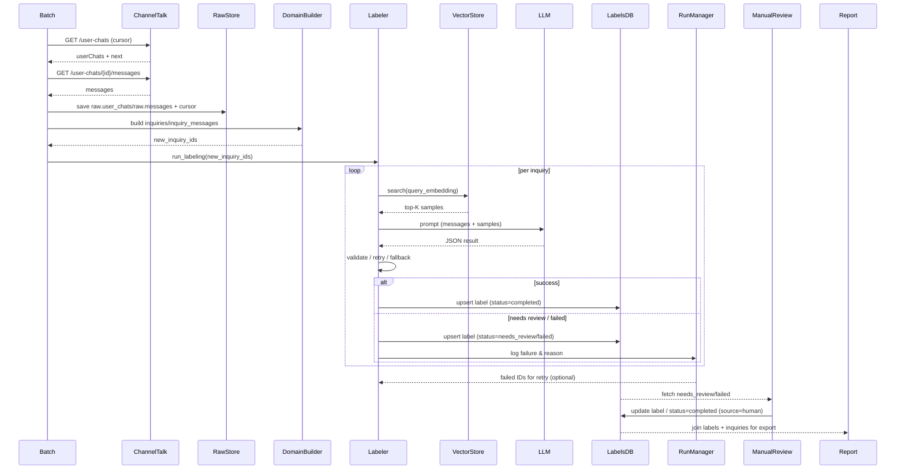

# ChannelTalk Open API 설계

## 1. 목적 & 범위

- ChannelTalk Open API를 통해 **문의(=UserChat)** 단위 데이터를 일 배치로 적재하고, 메시지 본문을 분석해 자동 라벨링 및 보고서/엑셀 생성을 지원한다.
- 설계 목표는 (1) 필요한 엔드포인트 정의, (2) 요청 파라미터 및 커서 운용 방법, (3) 원본 JSON을 보존하는 데이터 계층 구조를 명시하는 것이다.

## 2. API 사용 전략

### 2.1 `GET /open/v5/user-chats`

- **목적**: 문의방 목록 + 메타데이터 수집.
- **요청 파라미터**
  - `state`: `opened|closed|snoozed`; 배치 정책에 맞춰 선택. 예) `state=opened`.
  - `sortOrder`: `desc`(추천, 최신순) 또는 `asc`.
  - `limit`: 1~500; 기본 25. 초기 배치에서는 500으로 설정해 호출 수를 줄인다.
  - `since`: 페이징 커서. 직전 응답의 `next` 값을 저장해 두었다가 다음 호출에 그대로 전달한다. 최초 실행 시 생략.
- **주요 응답 필드(샘플 인터페이스)**
  ```jsonc
  {
    "next": "eyJjaGF0S2V5IjoiZ3Jvn0=",
    "userChats": [
      {
        "id": "uc_123",          // userChatId
        "channelId": "ch_45",
        "state": "closed",
        "managed": true,
        "userId": "user_1",
        "managerIds": ["mgr_1"],
        "assigneeId": "mgr_1",
        "teamId": "team_2",
        "tags": ["refund", "priority"],
        "handling": { "type": "auto" },
        "source": { "page": "...", "supportBot": {...} },
        "goalState": "achieved",
        "contactKey": "ckey",
        "contactOrder": 1656032152515,
        "openedAt": 1656032152526,
        "closedAt": 1656032152526,
        "createdAt": 1656032152527,
        "sessions": [...],
        "users": [...],
        "managers": [...],
        "chatTags": [...]
      }
    ]
  }
  ```
- **사용 방식**
  1. `next` 커서를 받아 저장 → 다음 배치의 `since` 값으로 재사용.
  2. 각 항목의 `id`를 `userChatId`로 기록해 메시지 API 호출에 사용.
  3. 메타 필드(state, tags, assignee, timestamps, sessions/users/managers 등)는 원본 보존 후 도메인 모델에 필요한 값만 추출한다.

### 2.2 `GET /open/v5/user-chats/{userChatId}/messages`

- **목적**: 특정 문의방의 메시지/봇 정보를 수집.
- **요청 파라미터**
  - `userChatId`: 부모 문의 ID (`/user-chats` 응답의 `id`).
  - `sortOrder`: `desc`(최신 우선) 또는 `asc`.
  - `limit`: 기본 25, 필요 시 조정.
  - `since`: 메시지 페이징 커서 (`next`를 저장했다가 이어받을 때만 사용).
- **주요 응답 필드**
  ```jsonc
  {
    "next": "eyJtZXNzYWdlS2V5IjoiZ3Iv...==",
    "messages": [
      {
        "id": "msg_1",
        "chatId": "uc_123",
        "personType": "user|manager|bot|system",
        "personId": "user_1",
        "plainText": "문의 내용...",
        "blocks": [...],
        "files": [...],
        "buttons": [...],
        "webPage": {...},
        "log": {...},
        "form": {...},
        "state": "sent",
        "createdAt": 1656032152433,
        "updatedAt": 1656032152427,
        "threadMsg": false
      }
    ],
    "bots": [
      { "id": "bot_1", "channelId": "ch_45", "name": "FAQ Bot", ... }
    ]
  }
  ```
- **사용 방식**
  1. `/user-chats`에서 받은 모든 `userChatId`에 대해 메시지 API 호출.
  2. 메시지를 시간순으로 정렬(`createdAt asc`)해 Conversation 분석에 사용.
  3. 첨부파일/액션/폼 등 추가 필드를 보존하면 이후 라벨 규칙 확장 시 재활용 가능.

## 3. 일간 배치 흐름

1. **커서 로드**: 저장소(예: DB, S3, local json)에서 `user_chats_cursor` 값을 조회. 없으면 `null`.
2. **User Chat 수집**:
   - `GET /user-chats?since=<cursor>&state=opened&sortOrder=desc&limit=500`.
   - 응답의 `userChats`를 `raw_user_chats` 저장(append)하고, `next`를 최신 커서로 갱신.
   - `next`가 없으면 더 이상 신규 데이터 없음 → 루프 종료.
3. **메시지 수집**:
   - 새로 적재한 각 `userChatId`별로 `GET /user-chats/{id}/messages`.
   - 메시지 `next` 커서가 있으면 `raw_messages`에 저장 후 `message_cursor[id]`로 갱신(필요 시 이어받기).
4. **도메인 변환 & 라벨링 큐**:
   - `ConversationFactory`가 raw 데이터를 읽어 `domain.inquiries` 객체를 생성.
   - 새 객체를 라벨링 워커 큐에 enqueue → LLM/룰 기반 분류 수행.
5. **커서 보존**: 배치 마지막에 `user_chats_cursor = next`를 durable storage에 기록. 실패 시 재시작 가능.

## 4. 데이터 계층 모델

| 계층               | 설명                                                                                  | 저장 예시                           |
| ------------------ | ------------------------------------------------------------------------------------- | ----------------------------------- |
| `raw.user_chats`   | `/user-chats` 응답을 변형 없이 저장. pagination cursor, sessions/users/managers 포함. | S3 JSON, Postgres JSONB, Parquet 등 |
| `raw.messages`     | `userChatId`별 `/messages` 응답 저장. 메시지/봇/커서 유지.                            | `raw_messages/<userChatId>.json`    |
| `domain.inquiries` | 한 문의 단위로 메타 + 메시지를 묶은 객체. 라벨링 대상.                                | DB table / parquet                  |
| `label.results`    | `domain.inquiries.id` 기준 라벨링 결과(`category`, `confidence`, `explanation`).      | Postgres table, CSV export          |

도메인 객체 예시:

```jsonc
{
  "id": "uc_123",
  "meta": {
    "channelId": "ch_45",
    "state": "closed",
    "tags": ["refund"],
    "assigneeId": "mgr_1",
    "managerIds": ["mgr_1"],
    "timestamps": {
      "createdAt": 1656032152527,
      "openedAt": 1656032152526,
      "closedAt": 1656032152526
    },
    "users": [...],
    "managers": [...],
    "sessions": [...]
  },
  "messages": [
    { "id": "msg_1", "sender": "user", "text": "...", "createdAt": 1656032152433 },
    { "id": "msg_2", "sender": "manager", "text": "...", "createdAt": 1656032152520 }
  ],
  "label": null
}
```

- `label` 필드는 자동 라벨링 후 `{ "category": "환불요청", "confidence": 0.83, "source": "gpt-4o-mini" }` 등으로 채운다.
- 원본과 도메인을 분리하면 재처리/엑셀 Export 시 원본 손실 없이 가공 로직만 교체 가능.

## 5. 확장 포인트

- **엑셀/CSV Export**: `domain.inquiries` + `label.results`를 조인해 채널/태그/라벨별 리포트를 생성. 원본 필드를 그대로 남겨두면 추가 컬럼을 쉽게 노출 가능.
- **재수집/리플레이**: `raw.*` 계층이 그대로 남아 있으므로 커서 초기화 후에도 과거 데이터를 재사용하거나, 새로운 라벨러 버전을 적용해 재처리할 수 있다.
- **필터/리포트 강화**: `state`, `tags`, `goalState`, `managerIds` 등 메타 필드를 기준으로 특정 구간만 추출해 별도 라벨링/모델 실험에 활용 가능.

이 문서를 기준으로 개발 시 `raw → domain → label` 순으로 책임을 분리하고, 커서값을 안정적으로 보존하는 배치 파이프라인을 구현한다.

## 6. 파이프라인 개요

1. **Ingest**: ChannelTalk Open API 호출로 user chat 메타와 메시지를 수집해 `raw` 계층에 저장하고 커서를 갱신.
2. **Normalize**: `ConversationFactory`가 raw 데이터를 결합·정제하여 `domain.inquiries` 객체를 생성.
3. **Label**: 라벨링 큐/서비스가 `domain.inquiries`를 입력으로 LLM/룰 기반 분류를 실행하고 `label.results`에 저장.
4. **Report**: `domain + label` 데이터를 조합해 CSV/엑셀/대시보드를 생성.
5. **Monitor**: 배치 러너가 단계 실행/에러/커서 상태를 추적하여 재시작 가능성을 확보.

## 7. 컴포넌트 설계

| 계층          | 주요 컴포넌트                                                        | 역할                                        |
| ------------- | -------------------------------------------------------------------- | ------------------------------------------- |
| Ingest        | `ChannelTalkClient`, `UserChatFetcher`, `MessageFetcher`, `RawStore` | API 호출/재시도, 커서 관리, raw 데이터 저장 |
| Normalize     | `ConversationFactory`, `SchemaValidators`                            | raw 데이터를 도메인 `Inquiry` 객체로 변환   |
| Labeling      | `LabelingQueue`, `LabelerService`, `LabelStore`                      | 라벨링 요청 큐 관리, LLM 호출 및 결과 저장  |
| Report        | `ReportBuilder`, `DashboardAPI(선택)`                                | `Inquiry+Label`을 조합해 CSV/리포트 생성    |
| Orchestration | `BatchRunner`, `MetricsLogger`, `Config`                             | 일 배치 스케줄, 상태 로깅, 설정 관리        |

각 컴포넌트는 패키지/폴더 단위로 구현할 수 있으며, 예: `src/ingest`, `src/domain`, `src/labeling`, `src/report`, `src/orchestrator`, `src/store`.

## 8. 데이터 저장 상세

### 8.1 Raw Layer

- **원칙**: API 응답을 변형 없이 저장하며, 커서와 수집 시각을 함께 기록해 재처리/감사를 지원.
- **테이블/컬렉션 예시**
  - `raw_user_chats`
    - `user_chat_id` (PK), `channel_id`, `state`, `payload`(JSONB), `cursor_next`, `fetched_at`.
    - `payload`에 `/user-chats` 응답 전체를 보존. `cursor_next`는 호출 직후 받은 `next` 값.
  - `raw_messages`
    - `user_chat_id`, `message_id`(PK), `payload`(JSONB), `cursor_next`, `fetched_at`.
    - 메시지 페이지마다 append하며, 동일 메시지 ID는 upsert.
- **저장소 선택**: 초기엔 Postgres JSONB 또는 Parquet 파일(S3/local). 대량 데이터 시 Data Lake + Glue Athena 패턴으로 확장 가능.

### 8.2 Domain Layer

- **목적**: 라벨링과 리포트가 바로 소비할 수 있는 정규화된 스키마 제공.
- **테이블 예시**
  - `inquiries`
    - `id`(=user_chat_id, PK), `channel_id`, `state`, `opened_at`, `closed_at`, `tags`(JSONB), `assignee_id`, `manager_ids`(JSONB), `meta`(JSONB), `message_count`, `built_at`.
  - `inquiry_messages`
    - `id`(=message_id, PK), `inquiry_id`, `sender_type`, `sender_id`, `created_at`, `text`, `attachments`(JSONB), `meta`(JSONB).
- `meta`에는 추가 필드(세션, goalState, source, supportBot 등)를 그대로 담아 향후 규칙에 활용.

### 8.3 Label Layer

- `labels`
  - `inquiry_id`(FK), `category`, `sub_category`, `confidence`, `model_version`, `prompt_version`, `explanation`, `labeled_at`.
  - 동일 문의를 여러 라벨러가 처리할 수 있도록 `version` 또는 `run_id` 필드 추가.
- `label_audit`
  - 수동 수정 내역, 검수 기록, human override를 저장해 품질 관리.

## 9. 배치/스케줄링 설계

- **잡 구분**
  1. `fetch_user_chats`: `user_chats_cursor`를 사용해 `/user-chats` 호출, `raw_user_chats` 적재.
  2. `fetch_messages`: 새 `user_chat_id` 목록으로 `/messages` 호출, `raw_messages` 적재.
  3. `build_inquiries`: raw 데이터를 조합해 `inquiries` + `inquiry_messages` upsert.
  4. `run_labeling`: 신규/미라벨 문의를 큐에 넣고 라벨링 처리, `labels` 저장.
  5. `export_reports`: `inquiries + labels` 조인해 CSV/리포트를 생성하고 공유 위치에 저장.
- **오케스트레이션**
  - 단순 MVP: Cron + Python 스크립트 체이닝, 커서는 로컬/DB에 저장.
  - 확장 시: Airflow/Prefect 등으로 DAG 구성, 태스크 간 의존성 관리, 재시작 지원.
  - 각 태스크는 idempotent하게 작성해 재시도 시 중복 저장을 피함(upsert).
- **모니터링**
  - 처리 건수, 실패 건수, 마지막 커서, 라벨링 응답 시간 등을 metric/log로 기록.
  - 경고 조건: 커서 정지(신규 데이터 없음), API 실패 반복, 라벨링 에러율 상승.

## 10. 라벨링 엔진 흐름

- **트리거 방식**: 배치 3단계(`build_inquiries`) 완료 후, 새롭게 적재된 `inquiry_id` 리스트를 `LabelerService`에 전달하는 push 방식. 상시 워커 없이 필요할 때만 실행.
- **단계**
  1. `run_labeling` 잡이 `new_inquiry_ids` 목록을 받아 라벨러 CLI/서비스를 호출.
  2. 라벨러는 각 ID에 대해 `domain.inquiries`와 `inquiry_messages`를 조회하고 프롬프트를 생성.
  3. LLM 호출 → JSON 파싱 → 스키마 검증 → `labels` 테이블에 저장.
  4. 실패 시 전체 잡을 재실행해도 동일 ID만 다시 처리하므로 재처리 부담이 낮음(별도 상태 관리 없이 로그만 남김).
- **추후 확장**: 실패율이 문제가 되면 `batch_runs` 기록이나 `pending` 상태 필드를 도입해 부분 재처리를 지원할 수 있다.

## 11. ConversationFactory (도메인 변환)

- **목표**: `userChatId` 단위로 메시지를 묶어 라벨러가 바로 사용할 수 있는 도메인 객체(`Inquiry`)를 생성.
- **처리 단계**
  1. `raw_user_chats`에서 `user_chat_id`, `channelId`, `state`, `tags`, 주요 타임스탬프 등 최소한의 메타만 추출.
  2. 해당 `user_chat_id`의 메시지를 `createdAt ASC`로 정렬하고, 중복 메시지는 `message_id` 기준으로 제거.
  3. 정리된 메시지를 배열 형태로 묶어 `Inquiry.messages`에 저장하고, 필요 시 메타 필드는 `Inquiry.meta`에 보존.
  4. 메시지가 하나도 없거나 필수 값이 비어 있으면 warning 후 skip.
- **결과**: 한 문의에 속한 전체 메시지가 하나의 구조에 담겨 라벨러/리포트에서 재사용이 쉬워진다.

### 11.1 데모 & 필드 단순화 예시
- `data/raw/demo/` (샘플 raw): `user_chats.json` + `messages_{id}.json`. 실제 ChannelTalk API 응답 구조를 그대로 따름.
- `scripts/demo_conversation_factory.py`: 샘플 raw를 읽어 `Conversation` dataclass로 변환한 뒤, 라벨링에 필요한 최소 필드만 남긴 JSON을 출력한다.
  - 실행: `python3 scripts/demo_conversation_factory.py`
  - 출력 구조(예시)
    ```jsonc
    {
      "id": "uc_demo_001",
      "channel_id": "ch_main",
      "created_at": "2024-05-19T15:58:20",
      "messages": [
        "안녕하세요. 어제 받은 신발이 사이즈가 안 맞아서 환불하고 싶어요.",
        "안녕하세요 고객님! …",
        "주문번호는 O-12345입니다. …",
        "확인되었습니다. …",
        "수거 후 3영업일 내 환불될 예정이며 …"
      ]
    }
    ```
- **의미**
  - 라벨링 프롬프트에는 메시지 배열만 전달해 토큰 사용량을 최소화한다.
  - `id`/`channel_id`/`created_at`은 결과 리포트에서 조인용 키로 유지한다.
  - 원본 메타데이터(발화자, 태그 등)는 `domain.inquiries`/`raw` 계층에 그대로 보존하므로, 라벨 결과 분석 시 필요한 필드를 언제든 다시 붙일 수 있다.

## 12. 샘플/벡터 설계

- **샘플 포맷**: 단순 JSON (`library.json`)에 `{ "text": "대화 내용", "labels": ["라벨1", "라벨2"] }` 구조로 저장. `sample_id`는 ingestion 시 자동 생성.
- **샘플 관리 UI**: JSON을 테이블 형태로 노출해 편집/추가 후 저장 버튼으로 반영. 저장 시 벡터 스토어를 전체 재빌드.
- **임베딩/벡터 스토어**: `samples.manager`가 JSON을 읽어 `text`를 임베딩하고, `sample_id`·`labels`를 메타데이터로 묶어 로컬 벡터 스토어(FAISS/Chroma 등)에 upsert. 인터페이스를 추상화해 추후 클라우드 벡터 DB로 전환 가능.
- **라벨링 시 검색**: 라벨 대상 대화 텍스트(원문 또는 요약)을 임베딩해 `VectorStore.search(query_vector, top_k)` 호출 → 상위 샘플 K개를 가져와 LLM 프롬프트에 참고 정보로 첨부. 유사도 threshold를 둬서 관련 없는 샘플은 제거.
- **확장 계획**: 샘플 버전 관리/롤백, 메타데이터 필터, Pinecone 등 외부 벡터 스토어 지원을 후순위 옵션으로 명시.

## 13. 긴 대화 처리 전략

- 기본: 가능하면 원문 전체를 한 번에 라벨링(LLM 입력 한도 내에서).
- 예외: 대화가 너무 길어 한 번에 넣기 어려우면 chunk 단위로 나눠 부분 요약 → 요약들을 합쳐 최종 요약 → 그 요약으로 라벨링.
- 장점: chunking으로 LLM이 한 번에 읽어야 하는 텍스트 양을 줄이면서도 전체 정보를 커버할 수 있음. 대부분 대화는 원문 라벨링, 초장문의 경우에만 2단계(요약→라벨링)를 적용.

## 14. 라벨링 프롬프트 설계

- **샘플 검색**: 라벨 대상 대화를 임베딩해 벡터 스토어에서 상위 K개의 샘플을 검색. 유사도가 높을 때만 프롬프트에 포함하고, 낮으면 “참고 샘플 없음”으로 진행.
- **프롬프트 섹션**
  - _System_: 역할/규칙/출력 형식 정의(예: “고객 문의를 분류하는 전문가로서 JSON만 출력”).
  - _Reference Samples_: 검색된 샘플 2~3개의 라벨+핵심 텍스트를 짧게 나열.
  - _Messages_: `Inquiry.messages`를 시간순으로 포맷팅. 필요 시 chunk로 나누고 요약을 덧붙임.
  - _Task/Instruction_: 라벨 스키마, JSON 출력 스키마, 확신 없을 때 처리 방식 등 명시.
- **프롬프트 예시**

  ```
  [Reference Samples]
  1) Label: 배송 지연 | Similarity: 0.83
     Text: "배송 예정일이 지났는데 아직도 준비중입니다."
  2) Label: 환불 요청 | Similarity: 0.76
     Text: "제품이 파손돼서 환불하고 싶습니다."

  [Messages]
  [2024-03-12 10:05] USER: 지난주에 주문한 상품이 아직도 도착하지 않았어요.
  [2024-03-12 10:10] MANAGER: 물류에서 지연이 있어 2일 내 배송 예정입니다.
  ...

  [Task]
  - Primary label from ["배송 지연","환불 요청","교환 문의","기타"].
  - Secondary labels optional; return [] when none.
  - Output JSON:
    {
      "label_primary": "<string>",
      "label_secondary": ["<string>", ...],
      "confidence": 0.0~1.0,
      "reasoning": "<<=200 chars>",
      "summary": "<1-2 sentences>"
    }
  ```

- **출력 검증**: LLM 응답은 JSON schema 검증 후 저장. 실패 시 재시도하거나 fallback 모델 호출.

## 15. 라벨링 결과 검증 시나리오

- **JSON 스키마 누락**
  - _상황_: LLM이 `{ "label_primary": "배송 지연", "confidence": 0.72 }`처럼 필수 필드(`label_secondary`, `reasoning`, `summary`)가 없는 JSON을 반환.
  - _대응_: JSON 스키마 검증에서 오류를 감지 → 동일 프롬프트로 재시도(최대 N회). 반복 실패 시 `status=failed`, `error=json_schema_missing_fields`로 기록 후 수동 검토.
- **스키마 외 라벨**
  - _상황_: 정의된 라벨 스키마는 `["배송 지연","환불 요청","교환 문의","기타"]`인데, LLM이 `"배송 문제"` 또는 `"환불 문의"` 같은 새로운 라벨을 생성.
  - _대응_: 응답 라벨이 스키마에 없으면 `invalid_label` 상태로 저장하고 로그를 남김. 필요 시 해당 라벨을 스키마에 추가하거나, 프롬프트에 “허용 라벨 외 사용 금지”를 명시해 재시도.
- **Confidence 임계치 미달**

  - _상황_: 모델이 `{ "label_primary": "교환 문의", "confidence": 0.42 }`처럼 낮은 확신도를 반환.
  - _대응_: threshold(예: 0.6) 이하인 경우 `status=needs_review`로 저장하고, 사람이 확인/수정할 수 있도록 별도 리스트나 UI에 노출. 수정된 결과는 `label_audit`에 기록해 추후 모델 개선에 활용.

- **재시도/로그**
  - JSON 파싱 실패, invalid label, low confidence 등 이벤트를 모두 로깅하여 빈도/패턴을 관찰.
  - 오류가 반복되면 라벨 스키마 또는 프롬프트를 조정하고, 샘플 품질을 점검하는 근거로 사용한다.

## 16. 라벨링 실행/재시도/수동 검토 흐름

- **LabelerService**
  - 배치가 전달한 `inquiry_ids` 리스트를 입력으로 받아, 각 문의에 대해 프롬프트 빌드 → LLM 호출 → 검증 → `labels` 저장을 수행.
  - JSON 파싱 실패나 스키마 오류 발생 시 동일 프롬프트로 N회 자동 재시도하고, 반복 실패하면 `status=failed`, `error_code`를 기록.
  - 필요 시 fallback 모델을 사용하며, 실제 사용 모델명은 `labels.model_version`에 저장.
- **LabelRunManager**
  - 라벨링 실행(run)을 추적하는 모듈. `run_id`, `inquiry_ids`, `success_count`, `failure_count`, `fallback_used` 등을 기록해 재시작이나 통계에 활용.
  - 실패 ID 목록을 보관해 재시도 시 동일 run 정보를 기반으로 다시 `LabelerService`를 호출.
- **Manual Review**
  - `labels.status IN ('needs_review','failed')` 항목을 UI/CSV로 노출해 사람이 수정할 수 있도록 함.
  - 사람이 라벨을 수정하면 `labels`에 `status=completed`, `source=human`, `confidence=1.0` 등으로 업데이트하고, 변경 이력은 `label_audit`에 기록.
- **연결 요약**
  1. 배치 → `LabelerService`: 새 `inquiry_ids` 전달.
  2. `LabelerService` → `labels`: 자동 결과 저장, 실패 시 `LabelRunManager`에 로그.
  3. `LabelRunManager` → 재시도 or `Manual Review`: 실패/미확신 건을 다시 처리.
  4. `Manual Review` → `label_audit`/`labels`: 사람이 최종 결정 후 기록.

## 17. 엔드-투-엔드 처리 플로우 요약

```
[Ingest Batch]
  └─ ChannelTalkClient → raw.user_chats/raw.messages
      └─ ConversationFactory → domain.inquiries/inquiry_messages
          └─ (배치) new_inquiry_ids 전달
              └─ LabelerService
                  ├─ 샘플 벡터 검색
                  ├─ 프롬프트 빌드 + LLM 호출
                  ├─ 검증/재시도/fallback
                  └─ labels 저장
                      ├─ status=completed → Report/Export
                      └─ status=needs_review/failed
                            ├─ LabelRunManager (재시도)
                            └─ Manual Review → label_audit 업데이트
```

- 위 플로우를 기준으로 각 모듈이 어떤 데이터를 건네받고, 다음 단계로 무엇을 전달하는지 한눈에 파악할 수 있다.
- Report/Export 단계는 `labels`와 `domain.inquiries`를 조인해 리포트/CSV/대시보드를 생성하며, 수동 검토 결과도 즉시 반영된다.

## 18. 시퀀스 다이어그램



## 19. 자주 헷갈리는 지점 정리

- **`new_inquiry_ids` 의미**: 이번 배치에서 새로 적재된 문의(`domain.inquiries`)의 ID 목록. 배치가 이 리스트만 `LabelerService`에 전달하고, 라벨러는 각 ID를 기준으로 저장소에서 최신 데이터를 직접 조회한다. 데이터 스냅샷을 매번 전달하지 않아도 되므로 재시도/수동 검토 시에도 ID만 있으면 되며, 다른 모듈과 데이터 일관성이 유지된다.
- **ID 기반 라벨링 절차**: 라벨러는 전달받은 ID로 `inquiries`/`inquiry_messages` 테이블을 읽어 프롬프트를 구성한다. 따라서 배치와 라벨러 사이에는 “ID만 주고받는다”는 느슨한 결합이 유지된다.
- **LLM 호출 횟수**: 한 문의(=한 `userChatId`)를 라벨링할 때마다 LLM을 한 번 호출하는 것이 기본. 하루 100건이면 100회 호출, 1,000건이면 1,000회 호출이 필요하다. 필요 시 특정 상태/태그만 우선 라벨링하거나 배치 빈도를 조절해 비용을 관리할 수 있다.

## 20. 장기 확장 고려 사항 (요약)

- **다중 소스 대응**: ChannelTalk 외 CSV/다른 API도 같은 라벨링 파이프라인을 거칠 수 있도록, 도메인 스키마(`inquiries`, `inquiry_messages`)를 소스 중립 구조(핵심 필드 + `meta` JSON)로 유지한다. 추후 새로운 어댑터가 추가되어도 라벨러/리포트는 동일 도메인 구조만 참조하도록 설계.
- **Export/Analytics 다양화**: 기본 CSV/엑셀뿐 아니라 요약 리포트, BI/SQL 쿼리까지 확장할 수 있도록 Export 모듈을 계층화한다. 초기에 `inquiries + labels` 전체를 내보내는 기능을 만들되, 집계/피벗/시각화가 추가될 것을 염두에 두고 데이터 스키마를 정규화해 둔다.
- **데이터 저장 전략**: 향후 Data Warehouse(예: BigQuery, Snowflake) 또는 DuckDB/Parquet 기반 분석으로 확장할 수 있게, 현재 저장소도 Parquet/CSV + RDB 조합 등 이동이 쉬운 포맷을 고려한다.
- **이후 논의 예정**: 보고/엑셀 Export 구체 설계, 모니터링/알림 방식, 다중 소스 어댑터 구조 등은 향후 단계에서 추가 논의한다.
